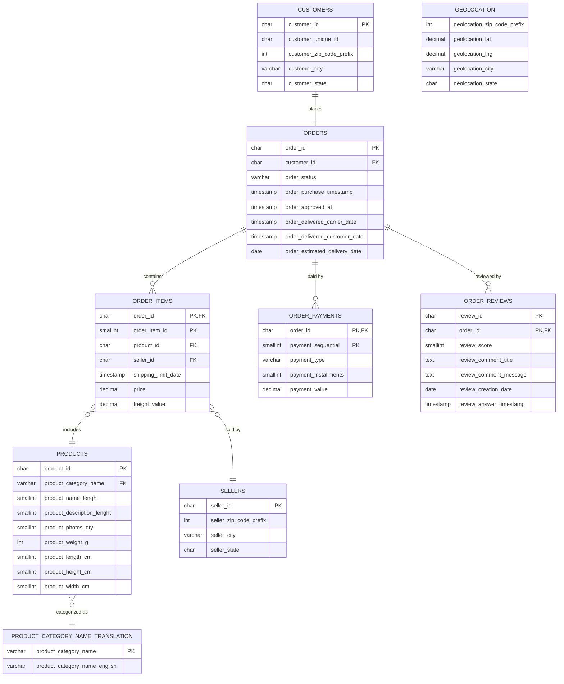
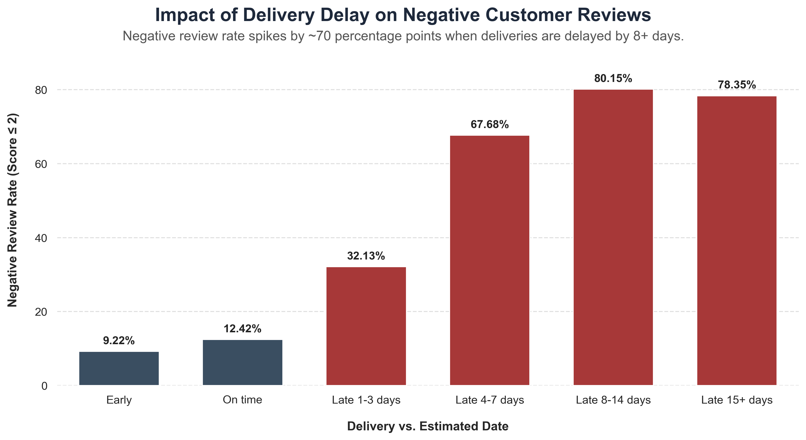

# Olist Customer Satisfaction Analysis

Finding out what really drives negative reviews on a Brazilian e-commerce marketplace, and what to fix first.

## Overview

This project analyzes the [Brazilian E-Commerce Public Dataset by Olist](https://www.kaggle.com/datasets/olistbr/brazilian-ecommerce), a real dataset of about 100,000 orders placed on the Olist marketplace between 2016 and 2018. It covers orders, customers, sellers, products, payments, and customer reviews.

The original plan was to study customer retention and lifetime value. Early in the project, the data showed that only about **3% of customers place more than one order**. With so few repeat customers, retention and lifetime value were not a useful focus. Instead, the project shifted to a question that matters for almost every customer: what makes their *first and likely only* purchase go well or badly.

**Main business question:** What causes negative customer experiences (`review_score` ≤ 2) on Olist, and which factor should the business prioritize to reduce them?

Every question below uses the same measure: **negative-review rate**, the percentage of orders with a review score of 2 or less.

- **Step 0 — Baseline:** Is the "2 or less" cutoff a reasonable definition of a negative review, and how does the negative-review rate change over time?
- **Q1 — Delivery Experience:** Does missing the promised delivery date predict negative reviews more strongly than delivery duration itself?
- **Q2 — Geography:** Once deliveries are on time, do some states still show more negative reviews?
- **Q3 — Sellers:** Once deliveries are on time, do some sellers still show more negative reviews?
- **Q4 — Product Category:** Once deliveries are on time, do some product categories still show more negative reviews?
- **Q5 — Payments:** Does payment type affect the negative-review rate on its own, or is it really a delivery-timing effect?

## Data Model

The dataset is a normalized, OLTP-style schema of 9 tables. `orders` sits at the center, linked one-to-one with `customers` and one-to-many with `order_items`, `order_payments`, and `order_reviews`. `order_items` connects each order to its `products` and `sellers`. A few points shaped how the data was queried: `customer_id` is generated per order, so real repeat-customer behavior has to be tracked through `customer_unique_id` instead; `order_items` and `order_payments` need composite keys because an order can include several products or several payment methods; and price and freight values live at the order-item level, so they need to be aggregated up to the order level for any revenue question.

Full modeling rationale, data quality notes, and key/relationship details are in [`docs/data-model.md`](docs/data-model.md).



## Key Findings & Recommendation

**Delivery timing is the strongest driver of negative reviews, by far.** The gap between the promised and actual delivery date predicts dissatisfaction much more strongly than delivery duration itself. Orders that arrive early have a 9.22% negative-review rate. That climbs to 80.15% for orders delivered 8–14 days late — a 70.93 percentage-point increase. Only 6.7% of orders arrive late, but they account for roughly 32.5% of all negative reviews in the dataset.



Once on-time orders are isolated, two secondary drivers remain:

- **Seller performance (Q3):** 74 sellers, out of 593 with enough volume to evaluate, show negative-review rates well above average (up to 53.93%) even when their deliveries are on time. Together they account for 7,428 orders — 8.3% of on-time volume.
- **Product category (Q4):** 9 categories, out of 63 with enough volume to evaluate, show negative-review rates above the 13.91% threshold. `fashion_male_clothing` (20.79%) and `office_furniture` (18.52%) are the clearest cases, with enough order volume to trust the result.

Geography (Q2) and payment type (Q5) were both ruled out as meaningful independent drivers. No state exceeded the flag threshold, and while voucher payments showed a small, unresolved elevation (10.95% vs. a 9.27% baseline), a follow-up check showed voucher orders are not disproportionately late — and voucher is the smallest payment group by a wide margin, so this is reported as an open question rather than a confirmed driver.

**Recommendation:**

1. Improve delivery-estimate accuracy and add logistics capacity during demand surges (e.g., November, ahead of Black Friday in Brazil) — this is the highest-leverage fix identified.
2. Monitor and support the 74 flagged sellers.
3. Investigate the 9 flagged product categories, starting with `fashion_male_clothing` and `office_furniture`.
4. Do not prioritize geography- or payment-specific initiatives based on current evidence.

Full findings, evaluation rules, and the ranking framework behind this recommendation are in [`docs/findings.md`](docs/findings.md).

## Known Limitations

- This analysis shows association, not proof of cause — this matters most for the comparison between payment type (Q5) and delivery timing (Q1).
- Review score is known to weight delivery experience heavily, so results should be read as "what best explains review score," not as the full real-world business impact of each factor.
- Q2, Q3, and Q4 only cover the on-time-filtered subset of their dimension. They describe the part of geography, seller performance, or product category that is independent of delivery lateness — not the full effect of any of them.
- The analysis is scoped to delivered orders only. Canceled or undelivered orders, likely an even bigger source of dissatisfaction, are out of scope.

Full methodology, including threshold choices and data quality decisions, is in [`docs/methodology.md`](docs/methodology.md).

## Repository Structure

```
olist-customer-satisfaction-analysis/
├── README.md
├── requirements.txt
├── .gitignore
├── .env.example
├── LICENSE
├── etl/
│   └── load_data.ipynb
├── sql/
│   ├── 01_schema.sql
│   ├── 02_deduped_reviews_view.sql
│   ├── 03_step0_baseline.sql
│   ├── 04_q1_delivery_experience.sql
│   ├── 05_q2_geography.sql
│   ├── 06_q3_sellers.sql
│   ├── 07_q4_product_category.sql
│   └── 08_q5_payments.sql
└── docs/
    ├── data-model.md
    ├── methodology.md
    ├── findings.md
    └── assets/
        └── delivery_delay_negative_review_rate.png
```

- **README.md** — project overview, ERD, key findings, and recommendations
- **requirements.txt** — pinned Python dependencies for the ETL notebook
- **.gitignore** — excludes the virtual environment, cache files, IDE files, and raw CSVs
- **.env.example** — template for the database connection settings and password
- **LICENSE** — usage license
- **etl/** — notebook that loads the CSVs into PostgreSQL
- **sql/** — schema, reusable view, and the analysis queries that answer the business question
- **docs/** — data model, methodology, findings, and the one supporting chart

## Tech Stack & Skills Demonstrated

- **PostgreSQL / SQL:** CTEs, window functions (`ROW_NUMBER()` for deduplication and for finding each order's primary payment), statistical thresholding (mean + standard deviation for flagging sellers), relational data modeling, and foreign-key-aware schema design.
- **Python / SQLAlchemy:** ETL pipeline that loads and validates the raw CSVs into the PostgreSQL schema, including data quality checks and fixes.

## How to Reproduce

1. Clone the repository.
2. Copy `.env.example` to `.env` and fill in your local database settings.
3. Download the dataset from Kaggle: [Brazilian E-Commerce Public Dataset by Olist](https://www.kaggle.com/datasets/olistbr/brazilian-ecommerce), and place the CSV files in a `data/` folder at the repository root (or set `OLIST_DATA_DIR` in `.env` to point to wherever you keep them).
4. Install dependencies:
   ```
   pip install -r requirements.txt
   ```
5. Create the database (name must match `OLIST_DB_NAME` in your `.env`):
   ```
   createdb -U postgres olist_ecommerce
   ```
6. Run the schema file to create the tables:
   ```
   psql -U postgres -d olist_ecommerce -f sql/01_schema.sql
   ```
7. Run `etl/load_data.ipynb` to load the CSVs into PostgreSQL.
8. Run the remaining SQL scripts in `sql/` in order (`02` through `08`), e.g.:
   ```
   psql -U postgres -d olist_ecommerce -f sql/02_deduped_reviews_view.sql
   ```

## Author

**Amirabas Ziaee**
GitHub: [github.com/aaziaee](https://github.com/aaziaee)
LinkedIn: [linkedin.com/in/amirabasziaee](https://linkedin.com/in/amirabasziaee)
