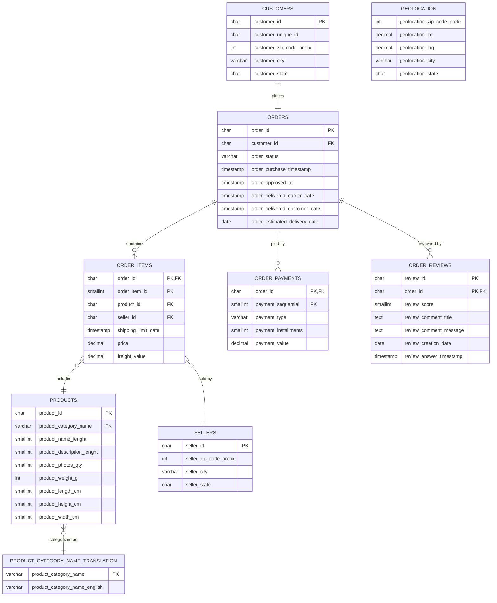

# Data Model

## Schema Overview

The Olist dataset follows a normalized, OLTP-style relational structure. It is made up of 9 tables that together describe the full lifecycle of an order: the customer who placed it, the order itself, the items and sellers involved, the payment, and the review left afterward. A separate table maps product categories from Portuguese to English, and a geolocation table provides zip-code-level location data.

The full schema definition (all `CREATE TABLE` statements) is available in [`sql/01_schema.sql`](../sql/01_schema.sql).

Table creation follows a specific order: parent tables (tables with no foreign key dependencies, or only dependencies on already-created tables) must be created before any table that references them. This is a PostgreSQL requirement — when a `CREATE TABLE` statement includes a `REFERENCES` clause, PostgreSQL checks that the referenced table and column already exist at that moment. If they don't, the statement fails. For this reason, `product_category_name_translation`, `sellers`, `customers`, and `geolocation` are created first, followed by `products`, `orders`, `order_items`, `order_payments`, and `order_reviews`, in that order.

## Table Grains

| Table | One row represents |
|---|---|
| `customers` | one `customer_id`, generated per order (not per person) |
| `orders` | one order |
| `order_items` | one line item within an order |
| `order_payments` | one payment transaction on an order |
| `order_reviews` | one review on an order |
| `products` | one product |
| `sellers` | one seller |
| `product_category_name_translation` | one category name mapping (Portuguese → English) |
| `geolocation` | one lat/lng sample for a zip code prefix (not unique per zip code) |

## Primary and Foreign Keys

| Table | Primary key | Foreign keys |
|---|---|---|
| `customers` | `customer_id` | — |
| `orders` | `order_id` | `customer_id` → `customers` |
| `order_items` | `order_id` + `order_item_id` (composite) | `order_id` → `orders`, `product_id` → `products`, `seller_id` → `sellers` |
| `order_payments` | `order_id` + `payment_sequential` (composite) | `order_id` → `orders` |
| `order_reviews` | `review_id` + `order_id` (composite) | `order_id` → `orders` |
| `products` | `product_id` | `product_category_name` → `product_category_name_translation` |
| `sellers` | `seller_id` | — |
| `product_category_name_translation` | `product_category_name` | — |
| `geolocation` | none (rows repeat per zip code) | none declared (loosely shares zip prefix with `customers`/`sellers`) |

**Why composite keys exist:**

`order_items` and `order_payments` both allow more than one row per order — an order can contain multiple products, and it can be paid using more than one payment method. In both cases, `order_id` alone cannot identify a single row, so a second column is needed.

`order_reviews` needs a composite key for a different reason: some `review_id` values are, by design, reused across two different orders (same review content, different order). This was confirmed directly:

```sql
SELECT review_id, COUNT(DISTINCT order_id) AS order_count
FROM order_reviews
GROUP BY review_id
HAVING COUNT(DISTINCT order_id) > 1;
```

This query returned 789 `review_id` values shared across two or more orders, confirming that `review_id` alone cannot guarantee uniqueness.

## Relationships

- `customers` and `orders` have a 1:1 relationship on `customer_id` (each generated `customer_id` maps to a single order).
*Note: this 1:1 relationship reflects how the source data generates a new `customer_id` per order — it is not enforced by a database constraint, since `orders.customer_id` has no `UNIQUE` constraint in the schema.* 
- `orders` has a 1:many relationship with `order_items`, `order_payments`, and `order_reviews`.
- `order_items` has a many:1 relationship with both `products` and `sellers`.
- `products` has a many:1 relationship with `product_category_name_translation`.
- `geolocation` sits outside this chain. It has no formal foreign key relationship and is only joined by zip code prefix when a question specifically requires geographic data. Because it contains duplicate rows per zip code, it must be aggregated (for example, averaging latitude and longitude per zip) before being joined to any other table.

## Modeling Decisions

Four modeling decisions matter before writing any query against this schema:

1. **`customer_id` is not the same as the real customer.** A new `customer_id` is generated for every order. `customer_unique_id` identifies the actual person and repeats across multiple `customer_id` rows. Any question involving repeat purchases, retention, or cohorts must group by `customer_unique_id`, not `customer_id`.
2. **`geolocation` has duplicate rows per zip code prefix.** Joining it directly into `orders` or `customers` will multiply row counts. It must be aggregated first (for example, taking the average latitude/longitude per zip) whenever geography is needed.
3. **Category names are stored in Portuguese in `products`.** English names exist only in `product_category_name_translation`. Coverage should be checked before relying on this table, to confirm that every category in `products` has a matching row.
4. **Price and freight are recorded at the order-item level, not the order level.** Any revenue-per-order question requires summing `price` across all items and aggregating up to `order_id` first.

## Entity-Relationship Diagram



*Note: `geolocation` is shown without a connecting relationship, since it has no declared foreign key. It shares zip code prefixes loosely with `customers` and `sellers` and is only used when a question specifically requires geographic analysis.*

## Data Quality Considerations

Two data quality issues in the schema were identified and handled during setup:

- **Orphan product categories.** Two categories present in `products` — `pc_gamer` and `portateis_cozinha_e_preparadores_de_alimentos` — had no matching row in `product_category_name_translation`. Without a fix, loading `products` would fail on the foreign key constraint. Both were added to the translation table with the English name left as `NULL`, rather than inventing a translation the source data never provided.
- **Missing product categories.** 623 of 32,951 products (1.9%) have no category at all. This is a real gap in the source data, not a loading error. The column was left nullable, and any category-level query needs to handle these products explicitly — either by filtering them out or labeling them as "uncategorized" — or they will silently drop out of the results.
